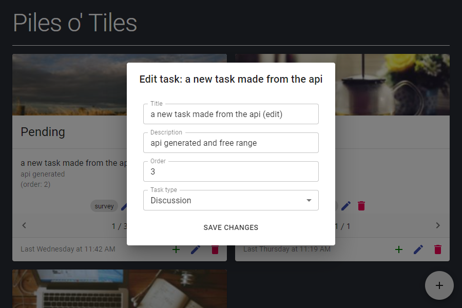
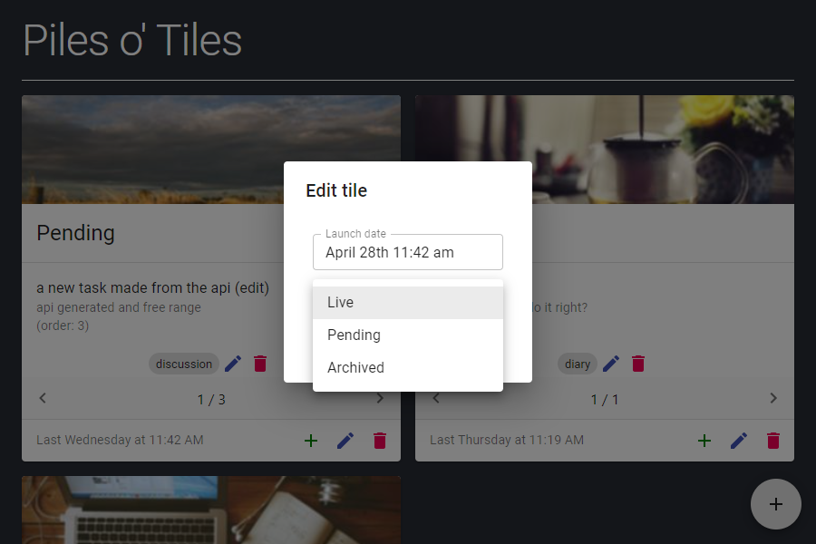

# task-tiles

A simple Django REST API + React front-end for managing cards with multiple nested elements.

## backend

Managed with `pipenv`. 
### Install
```
pipenv install
```

### Run
Use `run.sh` or 
```
pipenv run python manage.py runserver 0.0.0.0:8000
```

## frontend

Managed with Yarn 2.
### Install
```
yarn
```
### Run
```
yarn start
```

## Screenshots








